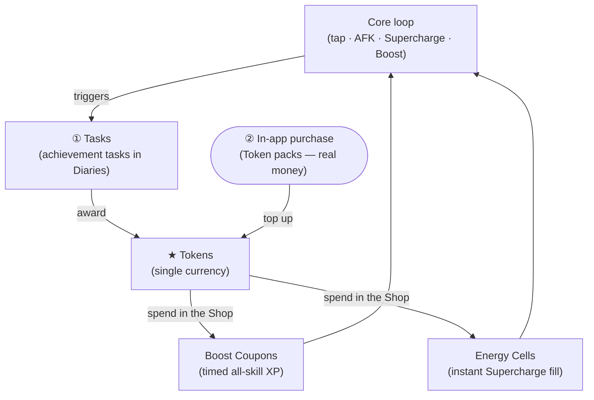

# XP Waste — Diary: Achievements & Rewards (design)

A design proposal to deepen XP Waste's mid-game and end-game by turning the flat, unrewarded
**Milestones** checklist into a living **achievement + reward economy**. OSRS-flavoured in name and
tone, but with mechanics tuned for a mobile tapper. Nothing here changes the core loop — it wraps a
layer of goals and a single spendable currency **around** it.

> **Status:** design. This document specifies mechanics, UX, data model, balance, and
> monetization so it can be built in phases (see [§11](#11-rollout-phases)). No gameplay numbers are
> final; every one lands in `Balance.swift` per the project's "re-balancing never touches gameplay
> code" rule. **Phase 1 (Tasks + Tokens) and the unified Token economy (this revision) are
> implemented.**
>
> **Resolved design decisions** (see [§14](#14-resolved-decisions)): a **single spendable currency —
> Tokens — is the whole economy.** Tokens are *earned* by completing Tasks and *bought* via IAP, then
> *spent* in the Shop on the game's two consumables (**Boost Coupons** and **Energy Cells**). XP Lamps
> exist only as a **Diary-tier clear reward** (earned, never bought), and there's no direct coupon/cell
> IAP: money buys Tokens, Tokens buy consumables. **Total
> Level** remains the prestige meter. The scale is tuned so paying yields far more Tokens than
> grinding Tasks, and one shop item costs many Tasks' worth of Tokens.

---

## 1. Why — the problem this solves

Today's goal structure is a barbell: a trickle of frequent **method upgrades** (every ~15–20 levels)
at one end, and the **very** long tail of "99 in everything → 200M in everything" at the other.
In between there's little to chase, and the plain **Milestones** checklist
(formerly `StatsView.milestonesSection`, since folded into Tasks) is a passive read-out — checkmarks
that grant *nothing*.

Four gaps:

1. **No reward for achievement.** Hitting a milestone gives no dopamine payout beyond a checkmark.
2. **No short/medium-term goals.** Between method tiers, a session has no bite-sized target.
3. **No daily reason to return** beyond the single free coupon.
4. **Only one flavour of "flex."** Max cape is the sole cosmetic identity; there's nothing to
   collect, equip, or show off along the way.

The **Diary** and unified **Token economy** tackle these: gaps 1–3 are addressed by the
shipped Tasks + spendable Tokens (earn achievements → spend on Boosts/Cells), and gap 4 (collectible
cosmetic "flex") is left for a future phase.

---

## 2. System overview — one currency, one Shop

Everything lives behind a single bottom-tab entry: the **Diary**
(a `book.closed.fill` tab) for earning, and the existing **Shop** for
spending. One currency ties them together:



- **① Tasks** — concrete, checkable achievement tasks, grouped into themed **Diaries** with
  difficulty tiers (§4). Completing one awards **Tokens**.
- **② IAP** — real-money **Token packs** top up the same pouch (§10). This is the *only* IAP: there
  are no direct consumable purchases anymore.
- **★ Tokens** — the single currency. Earned from Tasks, bought via IAP, and **spent in the Shop**
  on the two existing consumables:
  - **Boost Coupons** — a timed XP multiplier on every skill.
  - **Energy Cells** — an instant, single-skill Supercharge fill.

The existing **Total Level** (23 → 2277) stays the account's **prestige meter** — we don't add a
second score to compete with it.

**One currency, one metaphor** — Tokens are coins in your pouch. Achievements *earn* coins slowly;
IAP *buys* coins in bulk; the Shop is where coins turn into play. No parallel score, so the UI stays
legible on iPhone.

---

## 3. Total Level as the prestige meter + the cosmetic cape ladder

Rather than invent a new lifetime score, the design leans on the number the game already tracks and
displays front-and-centre: **Total Level**, climbing 23 → 2277. It's monotonic, familiar, and
already the Home header's hero stat.

To give that climb the OSRS-flavoured "where am I on the ladder" read, Total Level can later unlock a
**cosmetic cape ladder** that reuses OSRS's universally-understood metal ordering. Each rung would be
a purely cosmetic **equippable cape emblem** (rendered via `Artwork.swift`), granted free on reaching
its Total-Level threshold — a glanceable flex, not a power gate. *(This cosmetic ladder is a **future**
idea, not part of the current Token-economy revision.)*

| Rung | Cape | Illustrative Total Level |
|-----:|------|--------------------------:|
| 1 | **Bronze** | 150 |
| 2 | **Iron** | 300 |
| 3 | **Steel** | 500 |
| 4 | **Black** | 750 |
| 5 | **Mithril** | 1000 |
| 6 | **Adamant** | 1300 |
| 7 | **Rune** | 1600 |
| 8 | **Dragon** | 1900 |
| 9 | **Barrows** | 2200 |
| 10 | **Third Age** | 2277 (max cape territory) |

Thresholds would live in `Balance.capeLadder`, a one-line re-tune. *(Future — see the note above.)*

---

## 4. Tasks — the achievement layer

A **Task** is a single, concrete, checkable condition tied to a real game mechanic. Tasks are grouped
into **Diaries** (thematic sets) and, within a Diary, into **difficulty tiers**. This is the OSRS
*Achievement Diary* pattern, re-themed away from "regions" (which XP Waste doesn't have) toward the
account's actual activities.

### 4.1 Diaries

| Diary | Theme | Draws on |
|-------|-------|----------|
| **Combat Diary** | training the 6 combat skills | levels, crits, extra hits, Supercharge |
| **Production Diary** | the 7 production skills | levels, method tiers, tap XP |
| **Utility Diary** | the 5 utility skills | combos, refunds, crits, slotting |
| **Gathering Diary** | the 5 gathering skills | Energy procs, caches, Energy cap |
| **Idler's Diary** | AFK slots & offline | slots filled, offline returns, idle XP |
| **Tycoon's Diary** | the boost economy | Boosts, Energy Cells, stacked multipliers |
| **Completionist's Diary** | the long haul | 99s, category sweeps, max cape, 200M (folds in **all** of today's Milestones so nothing is lost) |

### 4.2 Difficulty tiers (within each Diary)

`Easy → Medium → Hard → Elite → Master → Grandmaster`. Higher tiers award more Tokens, and
**Grandmaster** collects VERY hard, end-game feats (200M-XP sweeps, 250 Boosts, the true-completion
cape). Completing **every Task in a tier** grants a **tier-matched XP Lamp** — an any-skill lamp
banked into the Diary lamp inventory (Easy→Bronze, Medium→Iron, Hard→Steel, Elite→Mithril,
Master→Adamant, Grandmaster→Rune). (In OSRS, clearing a diary tier is a landmark — we keep that
weight, now paid as a lamp instead of a Token lump.)

### 4.3 Example Tasks (concrete, hooked to existing mechanics)

These map directly onto hooks that already exist in `GameState`, so evaluation is cheap:

| Diary · Tier | Task | Trigger hook |
|---|---|---|
| Combat · Easy | Land your **first critical tap** | `rollTap` → `didCrit` (Slayer/Crafting) |
| Combat · Medium | Trigger a Supercharge on **3 different** combat skills | `supercharge(_:)` |
| Combat · Elite | Reach a **tier-6 method** on any combat skill | `currentTierIndex == 5` |
| Gathering · Easy | Bank a **full Energy meter** | `isEnergyFull(_:)` |
| Gathering · Medium | Collect **10 bird's-nest caches** | `rollTap` → `gotCache` (Woodcutting) |
| Gathering · Hard | Raise your Energy cap to **45s** | `energyCapSeconds` (Mining) |
| Utility · Medium | Reach a **×1.4 combo** | `comboMultiplier` (Agility) |
| Utility · Hard | **Refund** a coupon or Supercharge | `refundChance` proc (Thieving) |
| Idler's · Easy | Fill **all** your AFK slots | `slots.count == maxSlots` |
| Idler's · Medium | Return from offline with a **level-up** | `creditOfflineProgress` entry |
| Idler's · Elite | Earn **500k** XP in a single offline return | `OfflineProgress.totalXP` |
| Tycoon's · Easy | Stack a **Boost with a Supercharge** | both active in `rollTap` |
| Tycoon's · Hard | Hold **5 Boost Coupons** at once | `doubleXPCoupons` |
| Combat · Grandmaster | Reach **200M XP** in **all six** combat skills | `isMaxXP` sweep |
| Completionist · Grandmaster | **True completion** — 200M XP in **every** skill | `isMaxXP` all 23 |
| Completionist · — | **First 99**, all-combat-99, max cape, 200M… | today's Milestones, verbatim |

Tasks come in two shapes: **one-shot** (a condition that either has or hasn't happened) and
**cumulative** (a counter, e.g. "collect 10 caches"), the latter shown with a progress bar so partial
progress is visible and motivating.

### 4.4 Task rewards

Each Task awards **Tokens** scaled by its tier: **Easy 3 · Medium 8 · Hard 18 · Elite 42 · Master
90 · Grandmaster 180**. Completing an entire tier of a Diary instead grants a **tier-matched XP Lamp**
(Bronze→Rune) — a spend-anywhere lamp whose XP scales with the chosen skill's level, banked into the
Diary lamp inventory and used from the Diary Overview. Token values live in `Balance.Rewards` and
lamp values reuse `Balance.lampTierCoefficients`, so re-tuning the economy never touches gameplay or
view code. (The catalog — now **80 Tasks** across **6 tiers** — totals **≈ 3,606 Tokens** plus **42 XP
Lamps** (7 each of Bronze→Rune, one per Diary-tier clear) at 100%.)

---

## 5. Daily & Weekly Tasks — the return loop *(future)*

> **Not part of the current economy revision** — a future engagement layer. Documented here so the
> data model leaves room for it. When built, every payout is in **Tokens** (never permanent power).

A rotating set of small tasks that refresh on a schedule (reusing the existing `dayKey()` mechanism
and a new `weekKey()`), giving the missing reason to open the app every day.

- **3 Daily Tasks** — light, same-session tasks: "Tap 500 times", "Level up any skill 3×", "Spend a
  Boost", "Collect 5 caches". Award Tokens.
- **1 Weekly Task** — a bigger push: "Gain 2 levels across any skills", "Complete 6 Daily Tasks this
  week". Awards a larger Token bonus.
- **Adventurer's Streak** — a consecutive-day counter (like the daily coupon, but escalating).
  Longer streaks multiply daily Token payouts up to a cap. Missing a day resets the streak (never
  your Total Level), rewarding returning without harshly punishing lapses.

This layer is intentionally **all Tokens** — never permanent power — so daily play is rewarding but a
missed day is never a power setback.

---

## 6. The Shop — spending Tokens

Spending happens in the **existing Shop** (the `bag`/Boosts screen), now rebuilt around Tokens. Three
zones, top to bottom:

1. **Boost status hero** — unchanged: activate a Boost Coupon and watch the live multiplier/countdown.
2. **Token wallet** — a gold `star.circle.fill` card showing your current Token balance (the same
   glyph the Diary uses, so the currency reads identically everywhere).
3. **Spend Tokens** — two family cards priced **in Tokens**, buying inventory of the game's existing
   consumables:

| Buy | Price (Tokens) | What it does |
|-----|----------------|--------------|
| **Boost Coupon ×1** | **250** | One timed all-skill XP multiplier (the existing Double-XP coupon) |
| **Boost Coupon ×5** | **1,250** | Five, at the same unit price |
| **Energy Cell ×1** | **100** | Instantly fills the skill you're training to full Supercharge |
| **Energy Cell ×5** | **500** | Five, at the same unit price |

Buying adds to the **same inventory** the game already uses (`doubleXPCoupons`, `energyCells`), so all
existing use-flows — the daily free coupon, `activateDoubleXP`, `useEnergyCell` on the training
screen — are unchanged. Tokens are the only new thing: a purchase debits Tokens and credits an item.

### 6.1 The economy scale (the crux)

The whole point of the revision: **buying Tokens gives far more than grinding Tasks, and one shop item
costs many Tasks' worth of Tokens.** Concrete anchors (all in `Balance.Rewards`):

| Source | Tokens |
|--------|--------|
| One Easy Task | 3 |
| One Master Task | 90 |
| One Grandmaster Task | 180 |
| **Every Task (100% completion)** | **≈ 3,606** (+ 42 XP Lamps) |
| Smallest IAP (Pouch of Tokens, $0.99) | 500 |
| Middle IAP (Sack, $4.99) | 3,000 |
| Largest IAP (Chest, $9.99) | 7,500 |

What this produces:

- **A Boost Coupon (250) costs ~3 Master Tasks or ~80 Easy Tasks.** An Energy Cell (100) is about one
  Master Task. So achievement Tokens *do* buy real play — but deliberately slowly.
- **The entire free game (~3,606 Tokens) sits between the Sack (3,000) and Chest (7,500).** The $9.99
  Chest alone therefore exceeds *everything* you could ever earn from achievements, and even the $0.99
  Pouch (500) buys more than three of the biggest single Tasks → "paying gives a lot more" ✓.
- Because Tokens only ever buy **time** (Boosts) and **Supercharge convenience** (Cells) — never a
  permanent multiplier — this stays consistent with the project's monetization ethic: "spend for time
  and multipliers, never for permanent power" ([GAME_DESIGN §12](GAME_DESIGN.md)).

Every number here is one edit away in `Balance.Rewards`; nothing about the scale is baked into
gameplay or view code.

> **Out of scope (future):** *purchasable* XP Lamps, cosmetic capes/trims/home themes, and
> quality-of-life unlocks were explored in earlier drafts as additional Token sinks. They are **not**
> part of this revision — the Shop sells only Boost Coupons and Energy Cells today, and XP Lamps are
> earned solely from Diary-tier clears (never bought). If added later they must obey the same
> hard rule: **Tokens buy time, cosmetics, or convenience — never permanent power.**

---

## 7. Collection Log — the completionist meta *(future)*

> **Not part of the current economy revision.** A future completionist surface; documented for
> direction only.

A dedicated Log tab that tracks **everything**: every Task and Diary tier, shown as filled/empty slots
with an overall **completion %**. This is the flex that gives the end-game its depth:

- It reframes "200M in everything" from a lonely grind into one entry in a rich checklist.
- Great for screenshots and Game Center (a future "Collection %" leaderboard slots right in).

---

## 8. UX & screens (intuitive, universal)

The whole system rides existing patterns, so it feels native on day one and works on **iPhone and
iPad** (a hard project requirement):

- **Entry points** — the **Diary** tab in the bottom tab bar is where achievements are earned;
  the **Shop** tab is where Tokens are spent. Both are top-level tabs alongside Skills, Raids, and
  Settings.
- **Diary layout** — a segmented control: **Overview · All Tasks** (with *Collection* reserved for a future
  phase).
  - *Overview*: the Total-Level meter, Token balance, and progress summary.
  - *All Tasks*: a navigation drill-down — a list of Diaries; tap one to push its detail
    (tier → tasks). It's the same stacked push on every device; content is width-capped and centred
    (`.frame(maxWidth:…)`) like every other screen.
- **Shop layout** — the existing `BoostsView`, rebuilt around Tokens (§6): Boost status hero → **Token
  wallet** card → **Spend Tokens** family cards (Boost Coupons, Energy Cells, priced in Tokens) → **Get
  more Tokens** (IAP Token packs). Family cards and the width-cap/centre treatment are reused verbatim.
- **Celebration** — completing a Task fires a toast through the **existing** `notice`/overlay
  pipeline in `RootView`, plus a `SoundManager` cue. A **Diary completion** gets a larger, one-off
  celebration.
- **Home header** — a compact **Token chip** sits next to Total Level without crowding (the current
  supercharge/slots subtitle folds in).
- **Migration** — the old Stats screen's **Milestones** checklist is now folded into **Tasks** (e.g.
  the Idler's Diary's AFK-slot-unlock Tasks and the Completionist's Diary), so nothing regresses for
  players who know it. The rest of the old Stats screen moved into **Settings**, and the standalone
  Stats screen is gone.

---

## 9. Data model & persistence

All additions are **additive and backward-compatible**, following the established `SaveData`
pattern (new fields are optional so older saves keep decoding — see `GameState.SaveData`).

**`SaveData` fields (implemented this revision, all optional):**

```
tokens: Int?                        // single spendable balance (earned + purchased)
completedTasks: [String]?           // one-shot + finished cumulative task IDs
taskProgress: [String: Int]?        // partial counters for cumulative tasks
claimedDiaryTiers: [String]?        // Diary tiers already cleared (lamp granted)
diaryLamps: [RaidLampRecord]?       // unspent any-skill XP lamps from tier clears
```

*(Existing `doubleXPCoupons` / `energyCells` inventory is reused as-is — the Shop just tops it up.)*

**Future fields (reserved for later phases, still optional/back-compat):** `claimedCapeRungs`,
`dailyTaskDay`, `weeklyTaskWeek`, `dailyStreak`, `lastStreakDay`, `ownedCosmetics`, `equippedCape`,
`unlockedQoL`.

**Model files:**

- `Task.swift` — `Task`, `TaskDiary`, `TaskTier`, and the **static catalog** of all tasks (pure
  data, like `TrainingMethod.swift`). *(Implemented.)*
- `GameState+Rewards.swift` — the engine: `addTokens`, `evaluateTasks(trigger:)`, and banking a
  tier-matched XP Lamp (`bankDiaryLamp`) into the unified inventory on each Diary-tier clear.
  *(Implemented.)* Shop spending (`creditPurchasedTokens`, `buyBoostCoupon`,
  `buyEnergyCell`, affordability helpers) lives on `GameState`.

**Evaluation strategy.** Tasks index by **trigger type** (`.tap`, `.levelUp`, `.supercharge`,
`.offlineReturn`, `.boost`, `.slot`, …). Existing mutation points already fire these transitions —
`addXP` (level-ups/totals), `tap`/`rollTap` (crits, caches, combos, energy procs), `supercharge`,
`activateDoubleXP`, `useEnergyCell`, `toggleSlot`, `creditOfflineProgress` — so we call
`evaluateTasks(trigger:)` from each and only test the handful of tasks registered for that trigger.
No per-frame scanning; the 1 Hz tick already handles time-based checks.

**Debug hooks** (extend the existing `#if DEBUG` set for deterministic screenshots, per
`DEVELOPMENT.md`): `SEED_REWARDS` to seed levels/counters + satisfied tasks (which pay out Tokens),
`OPEN_SHEET=diary` to deep-link the Diary, and `SHOP_SCROLL=tokens` to auto-scroll the Shop
to its IAP Token-Packs section for below-the-fold captures.

---

## 10. Monetization — IAP

IAP is a **single family: Token packs.** Real money buys **Tokens**; Tokens buy the game's
consumables in the Shop (§6). There are no direct coupon/cell purchases and no XP-power products —
money buys the *currency*, and the currency only ever buys **time** (Boost Coupons) and **Supercharge
convenience** (Energy Cells), never permanent stat power (that stays earned via skill perks). Products
use `Store.swift`'s proven `grants` / mock-catalog pattern and a single `onGrant` callback that
credits Tokens.

| Pack | Price | Grants | Role |
|------|-------|--------|------|
| **Pouch of Tokens** | $0.99 | **500** Tokens | Entry top-up — 2 Boost Coupons or 5 Energy Cells. |
| **Sack of Tokens** | $4.99 | **3,000** Tokens | Mid tier — nearly a full achievement clear in one go. |
| **Chest of Tokens** | $9.99 | **7,500** Tokens | *Best value* — more than 100% Task completion yields. |

- **Paying gives far more than grinding.** 100% Task completion ≈ **3,606 Tokens**; the $4.99 Sack
  (3,000) covers most of it and the $9.99 Chest (7,500) exceeds it outright (~2.1×). Achievements make
  the currency *meaningful*; IAP makes it *fast*.
- **Non-pay-to-win by construction.** Tokens only buy time (Boosts) and convenience (Cells) — mirroring
  how coupons/Energy Cells already "sell time and multipliers, never permanent power"
  ([GAME_DESIGN §12](GAME_DESIGN.md)). Money buys *pace*, not a finished account.
- **The free game is complete.** Every Task and Diary is earnable without paying; the Shop is fully
  usable on achievement Tokens alone — just slower.
- **Reuse the plumbing.** Three product IDs (`com.callmegreg.xpwaste.tokens.small|medium|large`) in
  `Store`'s `productIDs`/`grants`, a `#if DEBUG` mock catalog, and `onGrant → creditPurchasedTokens`,
  wired into `Config/Products.storekit`.

---

## 11. Rollout phases

Shippable in independent slices, each valuable on its own:

1. **Tasks + Tokens (no spending).** ✅ **Implemented.** Catalog, trigger-based evaluation, the Log's
   Overview + Tasks tabs, Token earning, Home Token chip, and the task-completion toast.
2. **Unified Token economy + Shop + IAP.** ✅ **Implemented (this revision).** Tokens become
   spendable: the Shop sells Boost Coupons and Energy Cells for Tokens, and the sole IAP family is
   Token packs. One currency, earned or bought, spent on the two existing consumables.
3. **Daily/Weekly Tasks + Adventurer's Streak.** *(Future.)* The return loop.
4. **Collection Log.** *(Future.)* The completionist meta.
5. **Cosmetics / cape ladder.** *(Future.)* Purely vanity Token sinks (capes, trims, home themes).

Each phase is centralized-constants-first, so balancing every one is a `Balance.swift` pass.

---

## 12. Balance constants (all tunable in `Balance.Rewards`)

`Balance.Rewards` centralizes the entire economy: **per-Task Token grants** by tier
(3/8/18/42/90/180), **Shop prices** (`boostCouponCost` 250,
`energyCellCost` 100), and **IAP grants** (`iapTokensSmall` 500, `iapTokensMedium` 3,000,
`iapTokensLarge` 7,500). Diary-tier clears grant an XP Lamp whose value reuses
`Balance.lampTierCoefficients` (Bronze→Rune). Per house rule, **re-balancing this system never touches
gameplay or view code** — every number above is one edit here.

---

## 13. Risks & mitigations

| Risk | Mitigation |
|------|------------|
| **Pay-to-win perception** (Tokens buyable) | Tokens buy only time (Boosts) + Supercharge convenience (Cells); permanent power stays with perks; the free game is fully playable on earned Tokens. |
| **Achievement Tokens feel worthless next to IAP** | Tasks still buy real play (a Cell ≈ 1 Master Task; a Boost ≈ 2); IAP is a *shortcut*, deliberately scaled so grinding stays meaningful but slow. |
| **Currency confusion** | Just one currency (Tokens = coins). No parallel score; Total Level stays the sole prestige meter. |
| **Task-eval performance** | Trigger-indexed evaluation off existing mutation hooks; no per-frame scans. |
| **Scope creep** | Independent phases; the shipped economy needs no cosmetics/collection work. |
| **UI crowding on iPhone** | Earning behind one Log sheet; spending in the existing Shop; Home only gains a compact Token chip. |

---

## 14. Resolved decisions

Settled during design review:

1. **Currency model — one spendable currency, Tokens.** No separate score; **Total Level** remains the
   prestige meter. Tokens are earned from Tasks *and* bought via IAP, and spent in the Shop.
2. **Spending — the existing consumables.** Tokens buy **Boost Coupons** and **Energy Cells** (a
   two-step model: Tokens → inventory → use), preserving every existing use-flow and the free daily
   coupon. XP Lamps aren't bought — they're earned only by clearing a Diary tier, then spent on any skill.
3. **IAP — Token packs only.** Money buys the currency, not consumables directly; no XP-power or
   one-time-unlock products in this revision.
4. **Scale — paying ≫ grinding.** Per-Task 3–180; 100% completion ≈ 3,606 Tokens; Shop 250 (Boost) /
   100 (Cell); IAP 500 / 3,000 / 7,500. The $9.99 pack exceeds the entire achievement haul, yet one
   Shop item still costs many Tasks — so both paths feel worthwhile.

### Still to tune (needs play-session data, not a design blocker)

- Token payouts per Task tier and the tier-clear XP Lamp values.
- Shop prices (Boost Coupon / Energy Cell) and IAP grant amounts.
- Whether to add bulk-buy discounts or additional Shop items later.
