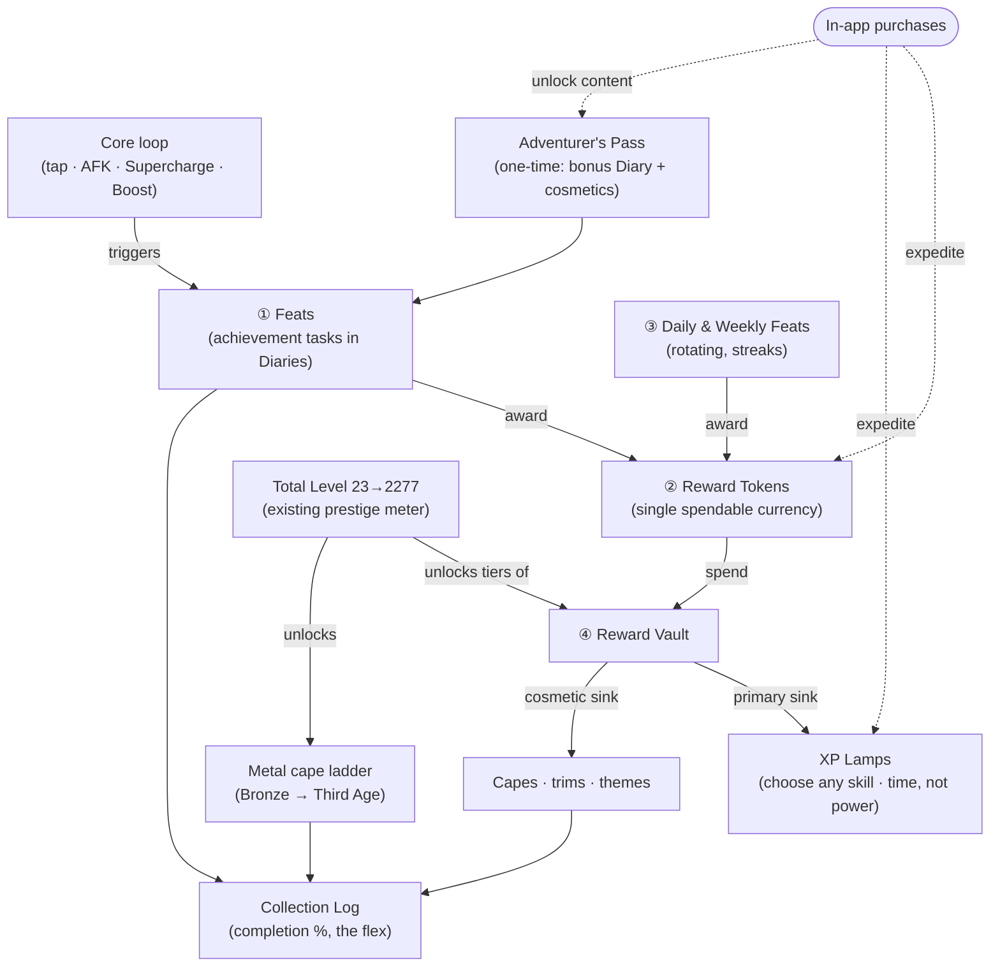

# XP Waste — Adventurer's Log: Achievements & Rewards (design)

A design proposal to deepen XP Waste's mid-game and end-game by turning the flat, unrewarded
**Milestones** checklist into a living **achievement + reward economy**. OSRS-flavoured in name and
tone, but with mechanics tuned for a mobile tapper. Nothing here changes the core loop — it wraps a
layer of goals, currency, and cosmetics **around** it.

> **Status:** design only. This document specifies mechanics, UX, data model, balance, and
> monetization so it can be built in phases (see [§11](#11-rollout-phases)). No gameplay numbers are
> final; every one lands in `Balance.swift` per the project's "re-balancing never touches gameplay
> code" rule.
>
> **Resolved design decisions** (see [§14](#14-resolved-decisions)): single spendable currency
> (**Reward Tokens**) with **Total Level** as the prestige meter; **XP Lamps are the headline reward
> and primary Token sink**; the premium IAP is a **one-time Adventurer's Pass**; Lamps apply to
> **any skill freely**.

---

## 1. Why — the problem this solves

Today's goal structure is a barbell: a trickle of frequent **method upgrades** (every ~15–20 levels)
at one end, and the **very** long tail of "99 in everything → 200M in everything" at the other.
In between there's little to chase, and the existing **Milestones** list
(`StatsView.milestonesSection`) is a passive read-out — checkmarks that grant *nothing*.

Four gaps:

1. **No reward for achievement.** Hitting a milestone gives no dopamine payout beyond a checkmark.
2. **No short/medium-term goals.** Between method tiers, a session has no bite-sized target.
3. **No daily reason to return** beyond the single free coupon.
4. **Only one flavour of "flex."** Max cape is the sole cosmetic identity; there's nothing to
   collect, equip, or show off along the way.

The **Adventurer's Log** fills all four with one coherent system.

---

## 2. System overview — one hub, one currency

Everything lives behind a single new toolbar entry on the Home hub: the **Adventurer's Log**
(a `book.closed.fill` button beside Stats/Settings). Inside, the pieces feed one economy:



- **① Feats** — concrete, checkable achievement tasks, grouped into themed **Diaries** with
  difficulty tiers (§4). Completing one awards **Reward Tokens**.
- **② Reward Tokens** — the single spendable currency, earned from Feats, Daily/Weekly tasks, and
  streaks; spent in the Vault; optionally topped up via IAP (§10).
- **③ Daily & Weekly Feats** — a rotating, streak-building engagement loop (§5).
- **④ Reward Vault** — spend Tokens on **XP Lamps** (the headline reward — §6.1),
  **cosmetic capes/trims/themes** (§6.2), and modest **quality-of-life unlocks** (§6.3).

The existing **Total Level** (23 → 2277) stays the account's **prestige meter** — we don't add a
second score to compete with it. Total Level also gates the Vault's growing stock and unlocks a
**cosmetic metal cape ladder** (§3). A **Collection Log** (§7) ties it together as a completion
percentage — the completionist end-game.

**One currency, one metaphor** — Tokens are coins in your pouch. No parallel score to reason about,
so the UI stays legible on iPhone.

---

## 3. Total Level as the prestige meter + the cosmetic cape ladder

Rather than invent a new lifetime score, the design leans on the number the game already tracks and
displays front-and-centre: **Total Level**, climbing 23 → 2277. It's monotonic, familiar, and
already the Home header's hero stat.

To give that climb the OSRS-flavoured "where am I on the ladder" read, Total Level unlocks a
**cosmetic cape ladder** that reuses OSRS's universally-understood metal ordering. Each rung is a
purely cosmetic **equippable cape emblem** (rendered via `Artwork.swift`), granted free on reaching
its Total-Level threshold — a glanceable flex, not a power gate:

| Rung | Cape | Illustrative Total Level |
|-----:|------|--------------------------:|
| 1 | **Bronze** | 150 |
| 2 | **Iron** | 300 |
| 3 | **Steel** | 500 |
| 4 | **Black** | 750 |
| 5 | **Mithril** | 1000 |
| 6 | **Adamant** | 1300 |
| 7 | **Rune** | 1600 |
| 8 | **Dragon** | 1900 |
| 9 | **Barrows** | 2200 |
| 10 | **Third Age** | 2277 (max cape territory) |

Thresholds live in `Balance.capeLadder` and are a one-line re-tune. The ladder also drives **Vault
stock gating** (§6): higher rungs unlock more Vault shelves, so the shop grows as you climb.

---

## 4. Feats — the achievement layer

A **Feat** is a single, concrete, checkable condition tied to a real game mechanic. Feats are grouped
into **Diaries** (thematic sets) and, within a Diary, into **difficulty tiers**. This is the OSRS
*Achievement Diary* pattern, re-themed away from "regions" (which XP Waste doesn't have) toward the
account's actual activities.

### 4.1 Diaries

| Diary | Theme | Draws on |
|-------|-------|----------|
| **Combat Diary** | training the 6 combat skills | levels, crits, extra hits, Supercharge |
| **Production Diary** | the 7 production skills | levels, method tiers, tap XP |
| **Utility Diary** | the 5 utility skills | combos, refunds, crits, slotting |
| **Gathering Diary** | the 5 gathering skills | Energy procs, caches, Energy cap |
| **Idler's Diary** | AFK slots & offline | slots filled, offline returns, idle XP |
| **Tycoon's Diary** | the boost economy | Boosts, Energy Cells, stacked multipliers |
| **Completionist's Diary** | the long haul | 99s, category sweeps, max cape, 200M (folds in **all** of today's Milestones so nothing is lost) |
| **Explorer's Diary** *(Pass)* | premium bonus set | unlocked by the Adventurer's Pass (§10) |

### 4.2 Difficulty tiers (within each Diary)

`Easy → Medium → Hard → Elite → Master`. Higher tiers award more Tokens. Completing **every Feat in a
tier** grants a **Diary-tier reward**: a chunky XP Lamp, a **trimmed** version of that category's
cape, and a Token bonus. (In OSRS, completing a diary tier is a landmark — we keep that weight.)

### 4.3 Example Feats (concrete, hooked to existing mechanics)

These map directly onto hooks that already exist in `GameState`, so evaluation is cheap:

| Diary · Tier | Feat | Trigger hook |
|---|---|---|
| Combat · Easy | Land your **first critical tap** | `rollTap` → `didCrit` (Slayer/Crafting) |
| Combat · Medium | Trigger a Supercharge on **3 different** combat skills | `supercharge(_:)` |
| Combat · Elite | Reach a **tier-6 method** on any combat skill | `currentTierIndex == 5` |
| Gathering · Easy | Bank a **full Energy meter** | `isEnergyFull(_:)` |
| Gathering · Medium | Collect **10 bird's-nest caches** | `rollTap` → `gotCache` (Woodcutting) |
| Gathering · Hard | Raise your Energy cap to **45s** | `energyCapSeconds` (Mining) |
| Utility · Medium | Reach a **×1.4 combo** | `comboMultiplier` (Agility) |
| Utility · Hard | **Refund** a coupon or Supercharge | `refundChance` proc (Thieving) |
| Idler's · Easy | Fill **all** your AFK slots | `slots.count == maxSlots` |
| Idler's · Medium | Return from offline with a **level-up** | `creditOfflineProgress` entry |
| Idler's · Elite | Earn **500k** XP in a single offline return | `OfflineProgress.totalXP` |
| Tycoon's · Easy | Stack a **Boost with a Supercharge** | both active in `rollTap` |
| Tycoon's · Hard | Hold **5 Boost Coupons** at once | `doubleXPCoupons` |
| Completionist · — | **First 99**, all-combat-99, max cape, 200M… | today's Milestones, verbatim |

Feats come in two shapes: **one-shot** (a condition that either has or hasn't happened) and
**cumulative** (a counter, e.g. "collect 10 caches"), the latter shown with a progress bar so partial
progress is visible and motivating.

### 4.4 Feat rewards

Each Feat awards **Tokens** scaled by its tier (illustrative: Easy 5 → Master 120). A handful of
signature Feats also grant a **named cosmetic** directly (e.g. "Max a skill" → that skill's **Cape of
Accomplishment**). Diary-tier completion adds a bonus Lamp + trimmed cape + Tokens. All values live
in `Balance`.

---

## 5. Daily & Weekly Feats — the return loop

A rotating set of small tasks that refresh on a schedule (reusing the existing `dayKey()` mechanism
and a new `weekKey()`), giving the missing reason to open the app every day.

- **3 Daily Feats** — light, same-session tasks: "Tap 500 times", "Level up any skill 3×", "Spend a
  Boost", "Collect 5 caches". Award Tokens.
- **1 Weekly Feat** — a bigger push: "Gain 2 levels across any skills", "Complete 6 Daily Feats this
  week". Awards a Lamp + Tokens.
- **Adventurer's Streak** — a consecutive-day counter (like the daily coupon, but escalating).
  Longer streaks multiply daily Token payouts up to a cap, and hit **streak milestones** (7/30/100
  days) that grant cosmetics. Missing a day resets the streak (never your Total Level or owned
  cosmetics), which rewards returning without harshly punishing lapses.

This layer is intentionally **all Tokens + cosmetics** — never permanent power — so daily play is
rewarding but a missed day is never a power setback.

---

## 6. Reward Vault — spending Tokens

A new **Vault** tab in the Log (styled like the existing Shop's family cards). You spend **Reward
Tokens** here. Your **Total Level** rung (§3) gates what's in stock, so the shelf grows as you climb.

### 6.1 XP Lamps — the headline reward (sell *time*, not power)

Straight out of OSRS quest rewards ("antique lamp"), Lamps are the Vault's centrepiece and its
**primary Token sink**: choose **any** skill (freely, including favourites you want to push) and apply
a chunk of XP. Three sizes at scaling prices:

| Lamp | Grants |
|------|--------|
| **Tarnished Lamp** | small XP boost |
| **Antique Lamp** | medium |
| **Radiant Lamp** | large |

**Guardrail — Lamps compress time, they don't skip the grind.** Lamp XP is **level-scaled** (a
percentage of the chosen skill's *next-level* requirement) with a **floor and a hard ceiling**, so a
Lamp is meaningful at level 5 *and* at level 92, but can never leap you up the brutal 92→99 tail (half
of a skill's total XP). Because a Lamp only compresses tapping you'd otherwise do, it stays consistent
with the project's monetization ethic — "spend for time and multipliers, never for permanent power"
([GAME_DESIGN §12](GAME_DESIGN.md)). Formula and caps live in `Balance.lampGrants`.

### 6.2 Cosmetics (the "look and feel" depth)

Pure vanity, all equippable, all rendered with the existing `Artwork.swift` / `ArtworkView`
pipeline (SF Symbols + the hand-authored `VectorIcon` set — **no emoji**, per house style):

- **Capes of Accomplishment** — one per skill, unlocked at 99 (earned, not bought); **trimmed**
  variants from completing that category's Diary tier.
- **Metal cape ladder** — Bronze → Third Age, unlocked free at Total-Level rungs (§3).
- **Milestone capes** — **Max Cape** (2277), **Completionist Cape** (full Collection Log).
- **Home themes / palettes** — cosmetic reskins of the parchment-and-rune background (a secondary
  Token sink).

Your **equipped cape** shows on the Home header (beside Total Level) and on the training screen — a
constant, glanceable flex.

### 6.3 Quality-of-life unlocks (modest, never power)

Convenience only, so spending Tokens (or buying them) can never buy *strength*:

- **Loadouts** — save/swap AFK-slot presets.
- **Extra Daily Feat slot** — a 4th daily task.
- **One-tap offline collect** — auto-dismiss the welcome-back summary.

> **Hard rule preserved:** permanent *power* comes only from skill perks
> ([GAME_DESIGN §4](GAME_DESIGN.md)). The Vault sells **time** (Lamps), **cosmetics**, and
> **convenience** — never a permanent multiplier. This is what keeps Tokens safe to sell for real
> money even with Lamps as the headline reward.

---

## 7. Collection Log — the completionist meta

A dedicated Log tab that tracks **everything**: every Feat, Diary tier, cape, cosmetic, and cape-ladder
rung, shown as filled/empty slots with an overall **completion %**. This is the flex that gives the
end-game its depth:

- It reframes "200M in everything" from a lonely grind into one entry in a rich checklist.
- **100% Collection Log** is the true completionist crown → the **Completionist Cape**.
- Great for screenshots and Game Center (a future "Collection %" leaderboard slots right in).

---

## 8. UX & screens (intuitive, universal)

The whole system rides existing patterns, so it feels native on day one and works on **iPhone and
iPad** (a hard project requirement):

- **Entry point** — a `book.closed.fill` toolbar button on Home opens the **Adventurer's Log** sheet
  (mirrors how `StatsView`/`BoostsView` present).
- **Log layout** — a segmented control: **Overview · Feats · Vault · Collection**.
  - *Overview*: the Total-Level cape-ladder meter, Adventurer's Streak, Token balance, and today's
    Daily/Weekly Feats.
  - *Feats*: a Diary list → tier → feats. On **regular width (iPad/landscape)** this is a **two-pane**
    layout (Diaries left, feats right) exactly like `SkillTrainingView`; on **compact** it's a
    stacked drill-down. Content is width-capped and centred (`.frame(maxWidth:…)`) like every other
    screen.
  - *Vault*: family cards reused from `BoostsView` (Lamps up top as the hero, then Cosmetics, then
    QoL). Lamp purchase opens a **skill picker** (any skill) with a live "+X XP → level N" preview.
  - *Collection*: an adaptive grid (`GridItem(.adaptive)`) of earned/unearned slots.
- **Celebration** — completing a Feat fires a toast through the **existing** `notice`/overlay
  pipeline in `RootView`, plus a new `SoundManager` cue (`.feat`). A **Diary completion** or a new
  **cape-ladder rung** gets a larger, one-off celebration.
- **Home header** — add a compact **Token chip** and the **equipped-cape** emblem next to Total Level,
  without crowding (the current supercharge/slots subtitle folds in).
- **Migration** — `StatsView`'s Milestones section becomes a compact summary that **deep-links** into
  the Completionist Diary, so nothing regresses for players who know it.

---

## 9. Data model & persistence

All additions are **additive and backward-compatible**, following the established `SaveData`
pattern (new fields are optional so older saves keep decoding — see `GameState.SaveData`).

**New `SaveData` fields (all optional):**

```
tokens: Int?                        // single spendable balance
completedFeats: [String]?           // one-shot + finished cumulative feat IDs
featProgress: [String: Int]?        // partial counters for cumulative feats
claimedDiaryTiers: [String]?        // Diary-tier rewards already granted
claimedCapeRungs: [String]?         // cape-ladder rungs already granted
dailyFeatDay: String?               // rotation key (reuses dayKey())
weeklyFeatWeek: String?             // rotation key (new weekKey())
dailyStreak: Int?; lastStreakDay: String?
ownedCosmetics: [String]?; equippedCape: String?
unlockedQoL: [String]?              // purchased QoL toggles
purchasedPass: Bool?                // Adventurer's Pass unlock (§10)
```

**New model files** (keep `GameState.swift` lean via an extension):

- `Feat.swift` — `Feat`, `FeatDiary`, `FeatTier`, and the **static catalog** of all feats (pure
  data, like `TrainingMethod.swift`).
- `Reward.swift` — Vault item definitions (Lamps, cosmetics, QoL), `Cosmetic`/`Cape`, and the
  cape-ladder rungs.
- `GameState+Rewards.swift` — the engine: `award(feat:)`, `spendTokens(on:)`, `useLamp(on:size:)`,
  streak/rotation handling, and a single cheap `evaluateFeats(trigger:)`.

**Evaluation strategy.** Feats index by **trigger type** (`.tap`, `.levelUp`, `.supercharge`,
`.offlineReturn`, `.boost`, `.slot`, …). Existing mutation points already fire these transitions —
`addXP` (level-ups/totals), `tap`/`rollTap` (crits, caches, combos, energy procs), `supercharge`,
`activateDoubleXP`, `useEnergyCell`, `toggleSlot`, `creditOfflineProgress` — so we call
`evaluateFeats(trigger:)` from each and only test the handful of feats registered for that trigger.
No per-frame scanning; the 1 Hz tick already handles time-based checks.

**Debug hooks** (extend the existing `#if DEBUG` set for deterministic screenshots, per
`DEVELOPMENT.md`): `SEED_REWARDS=<rung>` to seed Tokens/cosmetics/streak, and `OPEN_SHEET=log` to
deep-link the Adventurer's Log.

---

## 10. Monetization — IAP

IAP **expedites or unlocks new components**, staying strictly within the game's existing ethic —
**you buy time, content, and cosmetics; never permanent stat power** (that remains earned via skill
perks). New products extend `Store.swift`'s proven `ProductKind` / `grants` / mock-catalog pattern
alongside the current coupon and Energy-Cell families.

| Product family | Kind | What it does | Fairness |
|---|---|---|---|
| **Reward Token packs** | consumable | Tops up the Token pouch to **expedite** Vault purchases (Lamps, cosmetics). | Tokens only buy time + cosmetics + convenience, never power. |
| **XP Lamp bundles** | consumable | Direct Lamps to **expedite** a chosen skill. | Level-scaled with a hard ceiling: compresses tapping, never skips the 92→99 tail. |
| **Adventurer's Pass** | **non-consumable, one-time unlock** | Unlocks the premium **Explorer's Diary** (exclusive feats), an exclusive cosmetic cape line, a **+X% Token accrual**, and a 4th Daily Feat — bought once, kept forever. | No FOMO/seasonal reset; grants content + cosmetics + token *rate* (time), **no** permanent XP multiplier. |

- **Non-pay-to-win by construction.** Everything purchasable is time (Lamps/Tokens), content
  (Pass feats/cosmetics), or convenience — mirroring how coupons/Energy Cells already "sell time and
  multipliers, never permanent power" ([GAME_DESIGN §12](GAME_DESIGN.md)). Even with Lamps as the
  headline reward, the level-scaled ceiling means money buys *pace*, not a finished account.
- **The free game is complete.** Every cape, Diary, and cape-ladder rung is earnable without paying;
  IAP only shortens the path or adds *optional* cosmetic content. The Adventurer's Pass adds a *bonus*
  Diary, never gating base progression behind it.
- **Reuse the plumbing.** New product IDs in `Store.productIDs`/`grants`, new `#if DEBUG` mock packs,
  and `onGrant` routing to `addTokens` / `addLamps` / `unlockPass`, wired into `Config/Products.storekit`.

---

## 11. Rollout phases

Shippable in independent slices, each valuable on its own:

1. **Feats + Tokens (no IAP).** ✅ **Implemented.** Catalog, trigger-based evaluation, the Log's
   Overview + Feats tabs, Token earning, Home Token chip, and the feat-completion toast. Tokens
   accrue but aren't spendable yet. Immediately makes achievement *rewarding*.
2. **Reward Vault.** XP Lamps (the headline sink, with skill picker) + earned cosmetic capes + the
   Total-Level cape ladder + Home equipped-cape emblem.
3. **Daily/Weekly Feats + Adventurer's Streak.** The return loop.
4. **Collection Log.** The completionist meta + Completionist Cape.
5. **IAP.** Token packs, Lamp bundles, the one-time Adventurer's Pass (+ Explorer's Diary).

Each phase is centralized-constants-first, so balancing every one is a `Balance.swift` pass.

---

## 12. Balance constants (all new, all tunable)

A new `Balance` section (e.g. `Balance.Rewards`) centralizes: Token grants per Feat by tier, Diary-tier
bonus rewards, cape-ladder Total-Level thresholds + names, Vault stock gating by rung, lamp XP formula
+ floor + ceiling + Token prices, daily/weekly Token grants, streak multiplier curve + cap, and IAP
grant amounts. Per house rule, **re-balancing this system never touches gameplay or view code.**

---

## 13. Risks & mitigations

| Risk | Mitigation |
|------|------------|
| **Lamps undercut the "grind is the game" fantasy** | Level-scaled XP with a hard ceiling — Lamps compress time, never skip the 92→99 tail. All caps in `Balance`; Lamps priced so they're a treat, not a bypass. |
| **Pay-to-win perception** (Lamps buyable + primary sink) | Money buys *pace*, not a finished account; permanent power stays with perks; the free game is fully completable. |
| **Currency confusion** | Just one currency (Tokens = coins). No parallel score; Total Level stays the sole prestige meter. |
| **Feat-eval performance** | Trigger-indexed evaluation off existing mutation hooks; no per-frame scans. |
| **Scope creep** | Five independent phases; phase 1 ships value with zero economy or IAP. |
| **UI crowding on iPhone** | Everything behind one Log sheet; Home only gains a compact Token chip + cape emblem; two-pane only on regular width. |

---

## 14. Resolved decisions

Settled during design review (open items from the first draft, now closed):

1. **Currency model — single spendable Tokens.** No separate "Renown" score; **Total Level** remains
   the prestige meter, and the OSRS metal ladder becomes a *cosmetic* cape track pinned to Total-Level
   thresholds. Simpler UI, no parallel number to reason about.
2. **XP Lamps — prominent.** Lamps are the Vault's headline reward and primary Token sink, kept fair
   by the level-scaled ceiling (they sell *time*, not power).
3. **Adventurer's Pass — one-time unlock.** A non-consumable bought once and kept forever (no seasonal
   FOMO), granting the Explorer's Diary, an exclusive cosmetic cape line, +Token accrual, and a 4th
   Daily Feat.
4. **Lamp targeting — any skill freely.** Maximum player agency; the level-scaling + ceiling already
   prevent tail-skipping, so no need to exclude maxed skills.

### Still to tune (needs play-session data, not a design blocker)

- Cape-ladder Total-Level thresholds and Vault-gating rungs.
- Token payouts per Feat tier and Lamp Token prices.
- Lamp XP floor/ceiling percentages and the streak multiplier curve.
